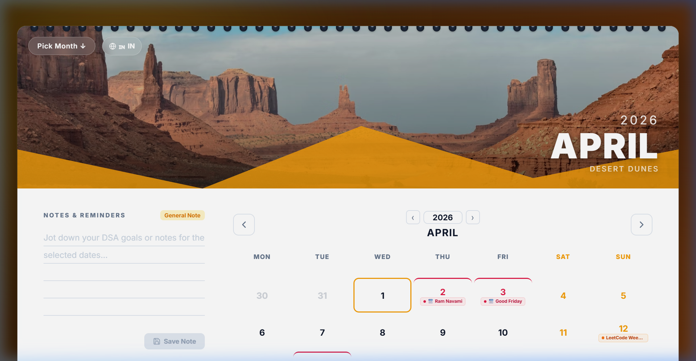
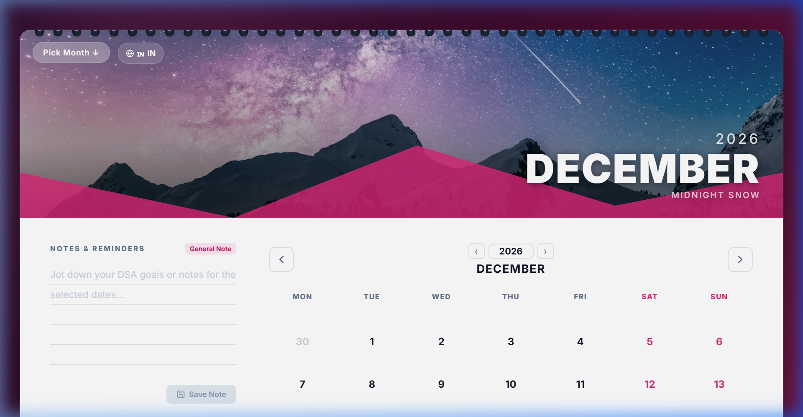
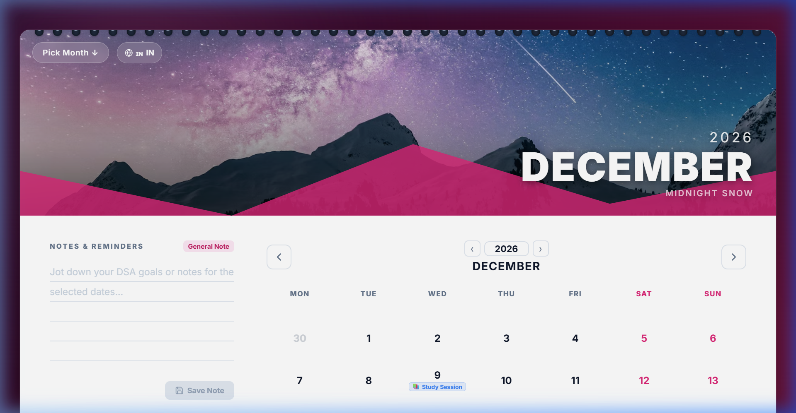

# 📅 TUF Interactive Wall Calendar

A high-performance, visually stunning monthly calendar designed for study goals. It simulates the aesthetic of a physical wall calendar with modern, interactive digital features and a fully responsive interface.



## ✨ Comprehensive Features

### 🎨 Visual & Aesthetic Wow Factors
- **Dynamic Theming:** Every month features a unique, high-resolution hero image. The entire UI palette (primary, secondary, and background colors) automatically shifts to complement the month's artwork, making the app feel alive and cohesive.
- **3D Page-Flip Animation:** High-fidelity CSS 3D transitions simulate the flipping of physical calendar pages during month navigation.
- **Physical "Wall" Design:** Realistic binding ring aesthetics, textured "paper" card layout, and an overall premium, tactile feel.
- **Vibrant Color Palettes:** Curated HSL-tailored colors that avoid generic defaults for a high-end designer look.

### 🖱️ Interaction & UX Excellence
- **Hybrid Date Selection:** Supports both **Drag-to-Select** for rapid range highlighting and a traditional **Click-to-Click** method.
- **Keyboard Navigation:** Full accessibility with arrow-key traversal across the grid and month boundaries. Use `Enter` to select and `Shift + Enter` to lock a range.
- **Smart Focus State:** Clear visual focus rings for keyboard users and subtle hover effects for mouse users.
- **⚡ Keyboard Productivity:**
  - `Arrow Keys`: Navigate between dates.
  - `Enter`: Select a single date or start/end of a range.
  - `Shift + Enter`: Quickly lock a date range.
  - `Double-Click` (Mouse): Open the tag menu instantly.

### 🏷️ The Smart Tagging & Sticker System
Elevate your schedule with a versatile tagging system designed for visual tracking:
- **Quick-Stamps:** Instantly drop preset DSA stickers like "Study Session" 📚, "Contest Day" 🏆, or "Mock Interview" 🧠 onto any date.
- **Custom Tags:** Create your own custom labels with a professional 10-color swatch palette for personalized organization.
- **Intuitive Interactions:** Trigger the tagging menu by hovering over a date and clicking the `+` button, or simply **Double-Click** any date for pro-level speed.
- **Easy Management:** View applied tags as sleek chips in each date cell; click any chip to instantly remove it.

### 📱 Fully Responsive & Mobile-Ready
- **Fluid Layouts:** The calendar gracefully adapts from large 4K monitors down to mobile screens.
- **Touch Targets:** Large, accessible touch targets for mobile users to tap dates and navigate months easily.
- **Responsive Sidebar:** The notes section adjusts its position based on screen width to maximize the calendar grid's visibility.

### 📝 Smart Notes & Goals
- **Contextual Organization:** Save detailed notes that are automatically stamped with your currently selected date range (e.g., "April 12 - April 15").
- **✅ Completion Tracking:** Mark your study goals as **Completed** or **Pending** with a single click. Completed notes are visually distinguished with a strikethrough and dimmed effect.
- **📊 Visual Progress Tracking:** A real-time progress bar shows the percentage of completed tasks, helping you stay motivated and on track with your DSA goals.
- **Local Storage Persistence:** All tags, note statuses, and country settings are saved locally in real-time—your data is safe even after a refresh.
- **Shareable URL State:** The URL hash updates with your selected range, allowing you to bookmark or share specific views (e.g., `#?start=2024-10-12&end=2024-10-15`).

## 📸 Screenshots

### Custom Theming (December)


### Interaction: Tags & Markdown Notes


## 🛠️ Technology Stack
- **Framework:** React (TypeScript) + Vite
- **Styling:** Vanilla CSS (Custom Design System with CSS Variables)
- **Icons:** Lucide React
- **Date Logic:** date-fns
- **Data Persistence:** Browser LocalStorage
- **API:** Nager.Date (Public Holidays)

## 🚀 Running Locally

1. **Clone the project**
   ```bash
   git clone <repository-url>
   cd <project-directory>
   ```

2. **Install dependencies**
   ```bash
   npm install
   ```

3. **Start the development server**
   ```bash
   npm run dev
   ```
   The app will be available at `http://localhost:5173`.

4. **Build for production**
   ```bash
   npm run build
   ```


Deployed Link - https://tuf-alpha.vercel.app/

---

